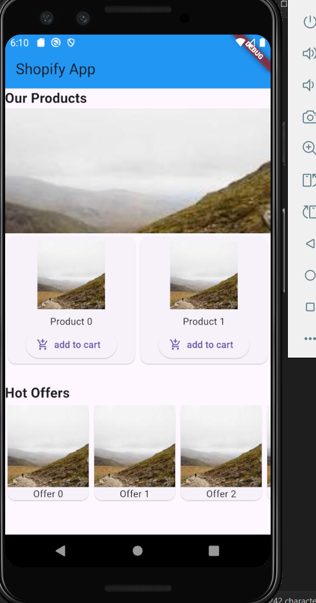
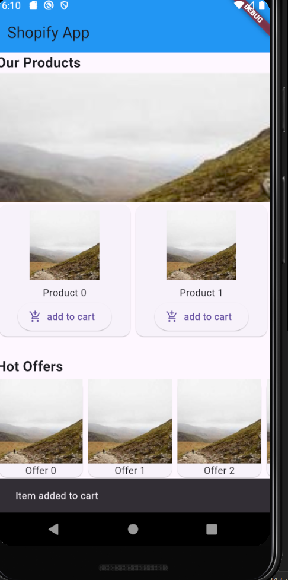
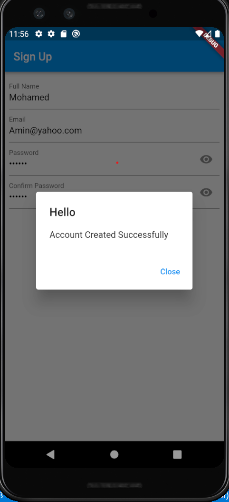
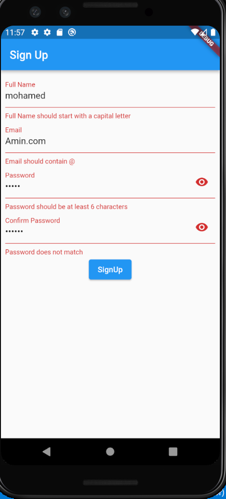

# Shopify App

This project is a Flutter-based mobile application that showcases an e-commerce layout with products, hot offers, and a shopping cart feature.

## Features

1. **Product Showcase**
    
    - Displays a list of products in a scrollable grid.
    - Each product includes an image, a title, and an "Add to Cart" button.
2. **Image Catalog**
    
    - A `PageView` widget allows users to swipe through product images.
3. **Hot Offers Section**
    
    - A horizontally scrolling `ListView` displays hot offers.
4. **Shopping Cart Interaction**
    
    - Users can add items to the cart by tapping the "Add to Cart" button.
    - A `SnackBar` notification confirms the action.
5. **User Sign-Up Page**
    
    - A form that allows users to create an account by entering their full name, email, password, and confirm password.
    - Validation checks for each field to ensure proper input:
        - Full name must start with a capital letter.
        - Email must contain an `@` symbol.
        - Password must be at least 6 characters long.
        - Confirm password must match the entered password.
    - Password visibility toggle for both password and confirm password fields.
    - Displays a success dialog upon successful form submission, with navigation to the home page.

## Code Overview

### Entry Point

```dart
void main() {
  runApp(const MainApp());
}
```

- The `MainApp` widget is the root of the application and sets up the `MaterialApp`.

### HomePage Widget

#### Description

The `HomePage` widget builds the main UI layout, including the app bar, product list, and hot offers section.

#### Key Components

- **AppBar**

```dart
appBar: AppBar(
  backgroundColor: Colors.blue,
  title: Text('Shopify App'),
),
```

Displays the title of the app.

- **Product List with GridView**

```dart
GridView.builder(
  gridDelegate: const SliverGridDelegateWithFixedCrossAxisCount(
    crossAxisCount: 2,
  ),
  itemCount: 2,
  itemBuilder: (BuildContext context, int index) {
    return Card(
      child: Column(
        children: [
          Padding(
            padding: const EdgeInsets.all(8.0),
            child: Image.network(
              'https://picsum.photos/200',
              width: 100,
              height: 100,
            ),
          ),
          Text('Product \$index'),
          ElevatedButton.icon(
            onPressed: _addToCart,
            icon: Icon(Icons.add_shopping_cart),
            label: Text('add to cart'),
          )
        ],
      ),
    );
  },
),
```

- **Hot Offers with Horizontal ListView**

```dart
ListView.builder(
  scrollDirection: Axis.horizontal,
  itemCount: 5,
  itemBuilder: (BuildContext context, int index) {
    return Card(
      child: Column(
        children: [
          Image.network(
            'https://picsum.photos/200',
            width: 120,
          ),
          Expanded(flex: 2, child: Text('Offer \$index')),
        ],
      ),
    );
  },
),
```

- **Add to Cart Functionality**

```dart
void _addToCart() {
  ScaffoldMessenger.of(context).showSnackBar(
    SnackBar(
      content: Text('Item added to cart'),
      duration: Duration(seconds: 2),
    ),
  );
}
```
### SignUp Widget

#### Description

The `SignUp` widget provides a user registration form with fields for full name, email, password, and confirm password.

#### Key Features

- **Form Validation**

```dart
validator: (value) {
  if (value != null && value.isEmpty) {
    return 'Field cannot be empty';
  }
  if (!value.contains('@')) {
    return 'Email should contain @';
  }
  return null;
},
```

- Validates each field to ensure correctness of input.
    
- **Password Visibility Toggle**
    

```dart
suffixIcon: IconButton(
  icon: Icon(hiddenPassword ? Icons.visibility : Icons.visibility_off),
  onPressed: () {
    togglePassword();
  },
),
```

- Toggles the visibility of the password and confirm password fields.
    
- **Success Dialog**
    

```dart
Future<void> successDialog() async {
  return showDialog<void>(
    context: context,
    builder: (BuildContext context) {
      return AlertDialog(
        title: const Text('Hello'),
        content: const Text('Account Created Successfully'),
        actions: <Widget>[
          TextButton(
            child: const Text('Close'),
            onPressed: () {
              Navigator.push(
                context,
                MaterialPageRoute(builder: (context) => HomePage()),
              );
            },
          ),
        ],
      );
    },
  );
}
```

- Displays a confirmation dialog upon successful registration.
## Dependencies

This project uses the following Flutter framework components:

- `MaterialApp`
- `Scaffold`
- `AppBar`
- `ListView`
- `GridView`
- `PageView`
- `SnackBar`
- `TextFormField`
- `Form`
- `AlertDialog`

## Screenshots

- **Main Page:** Displays the product list, image carousel, and hot offers.



- **SnackBar Notification:** Confirms when an item is added to the cart.



- **SignUp Page:**



- **SignUp Page With Corrupted data:**



## Getting Started

1. Clone the repository:
    
    ```bash
    git clone <repository-url>
    ```
    
2. Navigate to the project directory:
    
    ```bash
    cd simple_shopping_app
    ```
    
3. Install dependencies:
    
    ```bash
    flutter pub get
    ```
    
4. Run the app:
    
    ```bash
    flutter run
    ```
